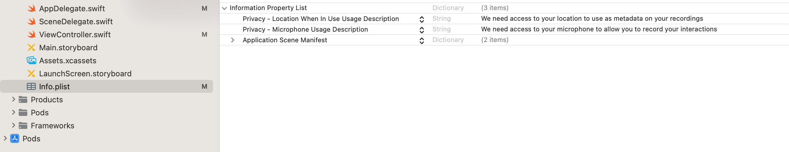
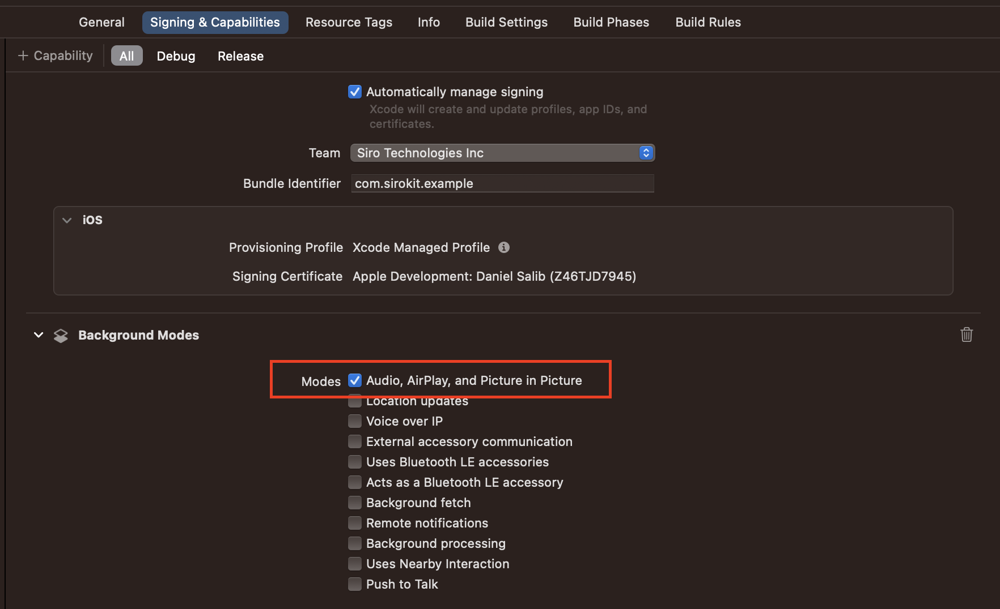

# SiroSDK for iOS

SiroSDK allows your users to create Siro recordings without navigating out of your app [why](https://www.notion.so/siroai/The-SiroSDK-58b8730f1db842d28fcc171ccb8cd3b6?pvs=4)

## Overview

Siro SDK allows you to display a recording button. It also exposes an API to control recordings as a byproduct of existing interactions in your app, making the recording experience automatic to the end user.

## Requirements

- Requires iOS 15+
- Compatible with UIKit and SwiftUI

## Swift UI Installation

### 1. Add SiroSDK to Cocoapods in your Podfile:

```
pod 'SiroSDK'
```

### 2. Add the following keys to the Info.plist:

- Privacy - Location When In Use Usage Description
- Privacy - Microphone Usage Description
  

### 3. Ensure background audio recording is enabled

- Signing & Capabilities -> Background Modes -> check Audio, AirPlay, and Picture in Picture



### 4. Call `setup()` and `handleAppWillTerminate()` within app entry point

Example App Entry Point (e.g., SiroSDKExampleApp.swift)

```swift
import SiroSDK
import SwiftUI

@main
struct SiroSDKExampleApp: App {
    @UIApplicationDelegateAdaptor(AppDelegate.self) var appDelegate
    init() {
        // For staging, use SiroSDK.setup(environment: .staging)
        SiroSDK.setup()  // <--- Add This
    }

    var body: some Scene {
        WindowGroup {
            ContentView()
        }
    }
}

// Add the App Delegate if it doesn't already exist
class AppDelegate: NSObject, UIApplicationDelegate {
    func applicationWillTerminate(_ application: UIApplication) {
        SiroSDK.handleAppWillTerminate() // <--- insert this to stop recordings in progress when the app is about to terminate
    }
}

```

### 5. Add the SiroSDK UI to your root view using the `SiroSDKButton`.

Root View (e.g., ContentView.swift)

```swift
import SiroSDK
import SwiftUI

@main
struct SiroSDKExampleApp: App {
    var body: some Scene {
        WindowGroup {
            SiroSDKButton()
        }
    }
}
```

## UIKit Installation

### 1. Add SiroSDK to Cocoapods in your Podfile:

```
pod 'SiroSDK'
```

### 2. Add the following keys to the Info.plist:

- Privacy - Location When In Use Usage Description
- Privacy - Microphone Usage Description
  

### 3. Ensure background audio recording is enabled

- Signing & Capabilities -> Background Modes -> check Audio, AirPlay, and Picture in Picture


### 4. Add `handleAppWillTerminate()` within `ApplicationWillTerminate` in the AppDelegate.swift

```swift
import UIKit
import SiroSDK

@main
class AppDelegate: UIResponder, UIApplicationDelegate {

  /** Your AppDelegate code */

  func applicationWillTerminate(_ application: UIApplication) {
      SiroSDK.handleAppWillTerminate() // <--- insert this to stop recordings in progress when the app is about to terminate
  }
}
```

## Usage & Customization

You can use the provided methods below to control your app's interaction with the SiroSDK. However, the SiroSDK includes an [opinionated button](###Included-Button) that can be immediatly used with minimal setup. Learn more in the Included Button section.

### Toggle Recording View

The recording view can be toggled using the following methods:

```swift
SiroSDK.show() // Shows Recording Bottom Sheet
SiroSDK.hide() // Hides Recording Bottom Sheet
```

### Read recording status

`SiroSDK.recordingStatus: SKRecorderState` is an enum with the current recording status. It can be one of the following:

```swift
public enum SKRecorderState {
    case paused
    case stopped
    case recording
    case notStarted
}
```

### Configure Events to Start and Stop Recording

Send events to the SiroSDK to control the recorder (e.g., start recording, save recording, discard recording, save and start new recording).
Different sales reps have different workflows, and events allow the flexibility for sales reps to customize their workflow.
You send a string of something happening in your app (e.g., map opened or pin dropped), and the recorder will respond according to the user settings or default behavior (e.g., start a new recording).
You can also include metadata with each event to improve the quality of analytics provided by Siro. Metadata is of the InteractionData type.
We currently support the events below. If you’d like other events, please reach out to chris@siro.ai and we’ll get back to you same-day with the updates.

Default Events and Actions:

| eventName           | recorder action  |
|---------------------|------------------|
| start               | start recorder   |
| stop                | stop recorder    |
| openPinMenu         | start recorder   |
| openLead            | start recorder   |
| openDataGridPanel   | start recorder   |
| dispositioned       | stop recorder    |
| pinClosed           | stop recorder    |
| closeDataGridPanel  | start recorder   |


Siro SDK must be initialized, otherwise events will be ignored. Check `SiroSDK.initialized` for the current initialization status.

```swift
SiroSDK.sendEvent(_ eventName: String, interactionData: InteractionData?)
```

### Logout the Current User

Users authenticate with the SDK using their Siro credentials. When the user logs out of your app, they should also be logged out of the SDK separately. You can logout the current user using the following:

```swift
SiroSDK.logout()
```

### Included Button

The SiroSDK provides a opinioned button that can be added to you app to quickly integrate with the SiroSDK.

#### SwiftUI Usage

```swift
HStack {
	Spacer()
	VStack {
		Spacer()
 		// optional buttonRadius - defaults to 30
		SiroSDKButton(buttonRadius: CGFloat)
	}
}
```

#### UIKit Usage

```swift
// optional buttonRadius - defaults to 30
let siroSDKButton = SiroSDKButton(buttonRadius: CGFloat).uiView()
siroSDKButton.translatesAutoresizingMaskIntoConstraints = false
view.addSubview(siroSDKButton)

// Setup Constraints
NSLayoutConstraint.activate([
		siroSDKButton.bottomAnchor.constraint(equalTo: view.bottomAnchor),
		siroSDKButton.trailingAnchor.constraint(equalTo: view.trailingAnchor, constant: -8)
])
```
