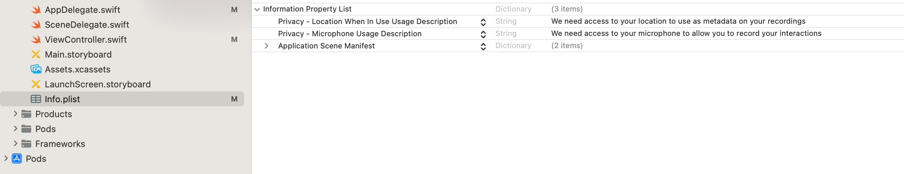
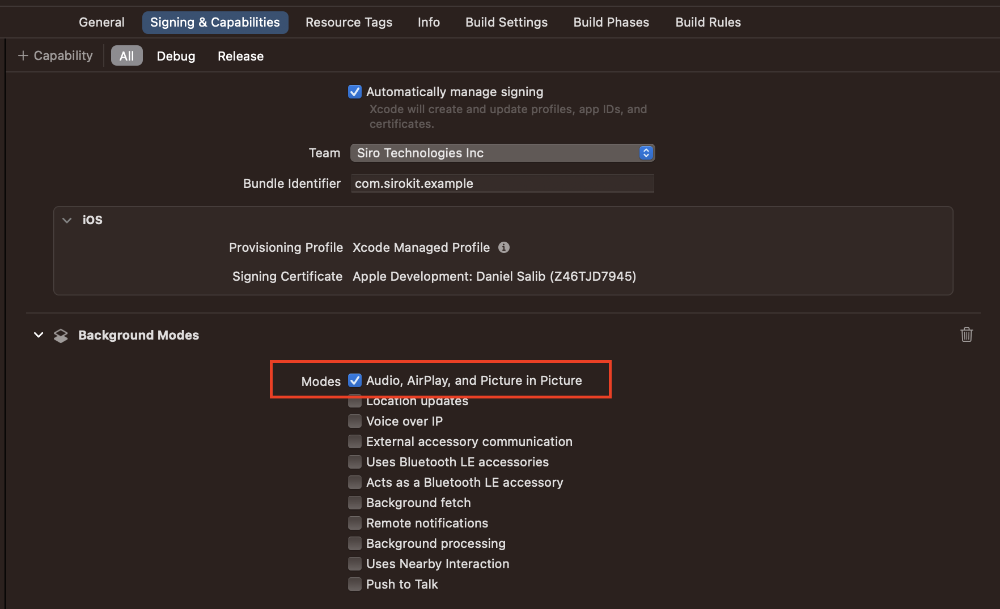

# SiroSDK for iOS

SiroSDK allows your users to create Siro recordings without navigating out of your app. The SDK provides a complete recording solution with automatic audio processing, transcription, and cloud synchronization.

## Requirements

- iOS 15.0+
- Swift 5.0+
- Works with Swift Package Manager (SPM) and CocoaPods

## Installation

### Swift Package Manager

Add SiroSDK to your project dependencies:

```swift
dependencies: [
    .package(url: "https://github.com/Siro-ai/SiroSDK.git", from: "2.0.7")
]
```

### CocoaPods

Add to your Podfile:

```ruby
pod 'SiroSDK'
```

Then run:
```bash
pod install
```

## Setup

### 1. Configure Info.plist

Add the following privacy keys to your `Info.plist`:

- `Privacy - Location When In Use Usage Description` - Required for location-based features
- `Privacy - Microphone Usage Description` - Required for audio recording



### 2. Enable Background Audio

In your Xcode project:
1. Go to **Signing & Capabilities**
2. Add **Background Modes**
3. Check **Audio, AirPlay, and Picture in Picture**



### 3. Initialize the SDK

Call `setup()` and `handleAppWillTerminate()` in your app's entry point:

```swift
import SiroSDK
import SwiftUI

@main
struct MyApp: App {
    @UIApplicationDelegateAdaptor(AppDelegate.self) var appDelegate

    init() {
        SiroSDK.setup()
    }

    var body: some Scene {
        WindowGroup {
            ContentView()
        }
    }
}

class AppDelegate: NSObject, UIApplicationDelegate {
    func applicationWillTerminate(_: UIApplication) {
        SiroSDK.handleAppWillTerminate()
    }
}
```

## Quick Start

### 1. Initialize with Authentication

```swift
import SiroSDK

// Initialize with your Siro authentication token
do {
    try await SiroSDK.initialize(withSiroToken: "your-auth-token")
    print("SDK initialized successfully!")
} catch {
    print("Initialization failed: \(error)")
}
```

### Initialize Offline (No Token)

If you don’t have a token yet, you can initialize offline with a `userId` and `organizationId`. Recordings will be saved under this user and can be uploaded later once a token is available.

```swift
await SiroSDK.initializeOffline(userId: "user_123", organizationId: "org_abc")
```

Notes:
- Offline recordings are stored locally and associated with the provided `userId` and `organizationId`.
- When you later call `initialize(withSiroToken:)` and the authenticated user’s id matches the offline `userId`, the SDK will upload those recordings.
- During upload, if a recording has no conversation type, the SDK will choose one in this order: recording’s set type → user’s preferred type → first available type fetched after token init.

> **Important**: Authentication tokens expire after 16 hours. The SDK should be reinitialized with a fresh token every app session to ensure proper functionality.

#### Exception Handling for Initialize

The `initialize(withSiroToken:)` method now provides comprehensive exception handling for token validation and network errors:

**Token Validation Errors:**
- **Invalid JWT Format**: Throws `NetworkError.unauthorized` for malformed tokens
- **Empty Token**: Throws `NetworkError.unauthorized` for empty strings
- **Expired Token**: Throws `NetworkError.unauthorized` for expired JWTs
- **Invalid Base64**: Throws `NetworkError.unauthorized` for tokens with invalid encoding

**Network Errors:**
- **401 Unauthorized**: Thrown when server rejects the token
- **Network Connectivity**: Thrown for connection issues
- **Server Errors**: Thrown for 5xx status codes
- **Decoding Errors**: Thrown for invalid response data

**Example Error Handling:**
```swift
do {
    try await SiroSDK.initialize(withSiroToken: token)
    print("✅ SDK initialized successfully!")
} catch NetworkError.unauthorized {
    print("❌ Token validation failed - check token format and expiration")
} catch NetworkError.serverError(let statusCode) {
    print("❌ Server error: \(statusCode)")
} catch {
    print("❌ Initialization failed: \(error.localizedDescription)")
}
```

### 2. Configure Recording Settings

```swift
// Set recording metadata
SiroSDK.recordingTitle = "My Recording"
SiroSDK.isPrivateRecording = false
SiroSDK.automaticSplitEnabled = true

// Set CRM integration data (optional)
SiroSDK.crmObjectId = "crm-123"
SiroSDK.crmObjectType = "contact"
SiroSDK.crmTenantId = "tenant-456"
SiroSDK.crmPlatform = "salesforce"
```

### 3. Start Recording

```swift
// Start recording with current settings
SiroSDK.startRecording()

// Check recording status
if SiroSDK.recordingStatus == .recording {
    print("Recording is active")
}
```

### 4. Monitor Recording Progress

```swift
// Get current recording time
let duration = SiroSDK.recordingTime

// Get audio samples for visualization
let samples = SiroSDK.audioSamples

// Use Combine for real-time updates (iOS 13+)
if #available(iOS 13.0, *) {
    SiroSDK.audioLevelsPublisher
        .sink { samples in
            // Update your audio visualizer
            updateAudioVisualizer(with: samples)
        }
        .store(in: &cancellables)
}
```

### 5. Stop and Save Recording

```swift
// Stop the current recording
SiroSDK.stopRecording()
```

### Upload Modes (Network Policy)

Control when uploads are allowed to run:

```swift
// .always: upload on any network (default)
// .wifi:   upload only on Wi‑Fi
// .never:  never upload automatically; manual triggers are also skipped
SiroSDK.uploadMode = .wifi
```

- Automatic background uploads respect this policy.
- Manual uploads via `uploadPendingChunks()` also respect this policy and will no‑op if not allowed.

## Complete Example

Here's a complete example showing how to integrate SiroSDK into your SwiftUI app:

```swift
import SiroSDK
import SwiftUI

struct ContentView: View {
    @State private var authToken: String = ""
    @State private var recordingTitle: String = ""
    @State private var isPrivate: Bool = false
    @State private var isRecording: Bool = false
    @State private var recordings: [SiroRecording] = []
    
    var body: some View {
        NavigationView {
            ScrollView {
                VStack(spacing: 20) {
                    // Authentication Section
                    VStack(alignment: .leading) {
                        Text("Authentication")
                            .font(.headline)
                        
                        TextField("Auth Token", text: $authToken)
                            .textFieldStyle(RoundedBorderTextFieldStyle())
                        
                        Button("Initialize SDK") {
                            Task {
                                do {
                                    try await SiroSDK.initialize(withSiroToken: authToken)
                                    print("✅ SDK initialized!")
                                } catch {
                                    print("❌ Initialization failed: \(error)")
                                }
                            }
                        }
                        .buttonStyle(.borderedProminent)
                    }
                    
                    // Recording Settings Section
                    VStack(alignment: .leading) {
                        Text("Recording Settings")
                            .font(.headline)
                        
                        TextField("Recording Title", text: $recordingTitle)
                            .textFieldStyle(RoundedBorderTextFieldStyle())
                        
                        Toggle("Private Recording", isOn: $isPrivate)
                        
                        Button(isRecording ? "Stop Recording" : "Start Recording") {
                            if isRecording {
                                SiroSDK.stopRecording()
                            } else {
                                SiroSDK.recordingTitle = recordingTitle
                                SiroSDK.isPrivateRecording = isPrivate
                                SiroSDK.startRecording()
                            }
                        }
                        .buttonStyle(.borderedProminent)
                        .disabled(authToken.isEmpty)
                    }
                    
                    // Recordings List
                    VStack(alignment: .leading) {
                        Text("Local Recordings")
                            .font(.headline)
                        
                        ForEach(recordings, id: \.localId) { recording in
                            RecordingRow(recording: recording)
                        }
                    }
                }
                .padding()
            }
            .navigationTitle("SiroSDK Demo")
            .task {
                await loadRecordings()
            }
            .onChange(of: SiroSDK.recordingStatus) { status in
                isRecording = status == .recording
            }
        }
    }
    
    private func loadRecordings() async {
        do {
            recordings = try await SiroSDK.getLocalRecordings()
        } catch {
            print("Error loading recordings: \(error)")
        }
    }
}

struct RecordingRow: View {
    let recording: SiroRecording
    
    var body: some View {
        VStack(alignment: .leading, spacing: 4) {
            Text(recording.title ?? "Untitled")
                .font(.headline)
            Text("Duration: \(recording.elapsedTime) seconds")
                .font(.caption)
            Text("Created: \(recording.dateCreated, style: .date)")
                .font(.caption)
        }
        .padding()
        .background(Color(.systemGray6))
        .cornerRadius(8)
    }
}
```

## API Reference

### Error Types

The SDK uses `NetworkError` enum for all network and token-related errors:

```swift
public enum NetworkError: LocalizedError {
    case invalidURL
    case noData
    case decodingError
    case serverError(Int)
    case unauthorized
    case invalidResponse(String)
    case unknown(Error)
}
```

**Error Descriptions:**
- `invalidURL`: The request URL is malformed
- `noData`: Server returned empty response
- `decodingError`: Failed to parse server response
- `serverError(Int)`: Server returned an error status code
- `unauthorized`: Token validation failed or token is invalid
- `invalidResponse(String)`: Server response format is unexpected
- `unknown(Error)`: Wrapped error from underlying network layer

### Core Properties

#### Recording Status
```swift
// Current recording status
SiroSDK.recordingStatus: SKRecorderState

// Check if SDK is initialized
SiroSDK.initialized: Bool

// Check if user is logged in
SiroSDK.isUserLoggedIn(): Bool

// SDK version
SiroSDK.version: String
```

#### Recording Configuration
```swift
// Recording metadata
SiroSDK.recordingTitle: String
SiroSDK.isPrivateRecording: Bool
SiroSDK.automaticSplitEnabled: Bool

// CRM integration (optional)
SiroSDK.crmObjectId: String?
SiroSDK.crmObjectType: String?
SiroSDK.crmTenantId: String?
SiroSDK.crmPlatform: String?
```

#### Audio Monitoring
```swift
// Current recording duration
SiroSDK.recordingTime: TimeInterval

// Audio level samples for visualization
SiroSDK.audioSamples: [Float]

// Audio levels publisher (iOS 13+)
SiroSDK.audioLevelsPublisher: AnyPublisher<[Float], Never>
```

### Core Methods

#### Initialization
```swift
// Setup SDK with environment
SiroSDK.setup(environment: .production)

// Initialize with authentication token
try await SiroSDK.initialize(withSiroToken: "token")

// Request recording permissions
SiroSDK.requestRecordingPermissions()
```

#### Recording Control
```swift
// Start recording
SiroSDK.startRecording()

// Pause recording
SiroSDK.pauseRecording()

// Stop recording
SiroSDK.stopRecording()

// Delete current recording
SiroSDK.deleteRecording()
```

#### Data Management
```swift
// Get local recordings
let recordings = try await SiroSDK.getLocalRecordings()

// Fetch user information
let user = try await SiroSDK.fetchUser()

// Fetch conversation types
let types = try await SiroSDK.fetchConversationTypes()

// Load resumable recording
let loaded = await SiroSDK.loadResumableRecording(recordingId: "id")

// Manually trigger upload of any pending chunks
let uploadedCount = await SiroSDK.uploadPendingChunks()
```

#### UI Control
```swift
// Show SDK interface
SiroSDK.show()

// Hide SDK interface
SiroSDK.hide(withDelay: true)

// Logout user
SiroSDK.logout()
```

### Delegates

The SDK provides several delegate protocols for handling events:

```swift
// Recording events
SiroSDK.recordingDelegate = self

// Permission events
SiroSDK.permissionDelegate = self

// Audio level events
SiroSDK.audioLevelDelegate = self

// User events
SiroSDK.userDelegate = self

// Token events
SiroSDK.tokenDelegate = self
```

#### Token Delegate

The `SiroSDKTokenDelegate` protocol allows you to handle token-related errors and events:

```swift
class MyTokenDelegate: SiroSDKTokenDelegate {
    
    // Called when token validation fails during initialization
    func didFailTokenValidation(error: NetworkError, context: String) {
        print("🔐 Token validation failed: \(error.localizedDescription)")
        print("📍 Context: \(context)")
        
        // Handle token validation failure
        // This could trigger a token refresh flow, show an alert, etc.
    }
    
    // Called when a network request fails due to token issues
    func didFailTokenRequest(error: NetworkError, endpoint: String, statusCode: Int?) {
        print("🔐 Token request failed: \(error.localizedDescription)")
        print("📍 Endpoint: \(endpoint)")
        print("📍 Status Code: \(statusCode ?? -1)")
        
        // Handle token request failure
        // This could trigger a token refresh flow, logout user, etc.
    }
}

// Set the token delegate
SiroSDK.tokenDelegate = MyTokenDelegate()
```

**Token Delegate Use Cases:**
- **Token Refresh**: Automatically refresh expired tokens
- **User Logout**: Logout user when token becomes invalid
- **Error Reporting**: Log token errors for debugging
- **UI Updates**: Show token status in your app's UI
- **Retry Logic**: Implement retry mechanisms for failed requests

**Example Implementation:**
```swift
class AppTokenDelegate: SiroSDKTokenDelegate {
    func didFailTokenValidation(error: NetworkError, context: String) {
        // Show alert to user
        showAlert(title: "Authentication Error", 
                 message: "Please log in again to continue recording.")
        
        // Trigger logout flow
        SiroSDK.logout()
    }
    
    func didFailTokenRequest(error: NetworkError, endpoint: String, statusCode: Int?) {
        if statusCode == 401 {
            // Token expired during API call
            refreshTokenAndRetry()
        }
    }
    
    private func refreshTokenAndRetry() {
        // Implement your token refresh logic
        // Then reinitialize the SDK with the new token
    }
}
```

## Data Storage

The SiroSDK stores data in two main locations:

### 1. Metadata Storage
- All metadata is stored in `siro/LocalDataStore.json` in the user's documents directory
- This includes:
  - User information
  - Conversation types
  - Recording metadata
  - Chunk metadata
  - Last updated timestamp

### 2. Audio Chunks
- Audio chunks are stored in subdirectories under `siro/` named with their local recording ID
- Each recording's chunks are organized as:
  ```
  siro/
  ├── LocalDataStore.json
  └── {localRecordingId}/
      ├── {localChunkId1}.{extension}
      ├── {localChunkId2}.{extension}
      └── ...
  ```
- Chunks are associated with their recording through the `recordingId` field in the metadata

## Best Practices

### 1. Error Handling
Always wrap SDK calls in try-catch blocks:

```swift
do {
    try await SiroSDK.initialize(withSiroToken: token)
} catch {
    // Handle initialization error
    print("Initialization failed: \(error)")
}
```

### 2. Permission Management
Request permissions early in your app lifecycle:

```swift
// Request permissions when app launches
SiroSDK.requestRecordingPermissions()
```

### 3. Recording State Management
Monitor recording status changes:

```swift
.onChange(of: SiroSDK.recordingStatus) { status in
    switch status {
    case .recording:
        // Update UI for active recording
    case .paused:
        // Update UI for paused recording
    case .stopped:
        // Handle recording completion
    default:
        break
    }
}
```

### 4. Background Audio
Ensure your app handles background audio properly:

```swift
// In your AppDelegate
func applicationWillTerminate(_: UIApplication) {
    SiroSDK.handleAppWillTerminate()
}
```

### 5. CRM Integration
Set CRM metadata before starting recording:

```swift
// Set CRM data before recording
SiroSDK.crmObjectId = "contact-123"
SiroSDK.crmObjectType = "contact"
SiroSDK.crmTenantId = "tenant-456"
SiroSDK.crmPlatform = "salesforce"

// Start recording
SiroSDK.startRecording()
```

## Troubleshooting

### Common Issues

1. **Initialization Fails**
   - Ensure you have a valid authentication token
   - Check network connectivity
   - Verify the token has proper permissions

2. **Recording Permissions Denied**
   - Request permissions explicitly: `SiroSDK.requestRecordingPermissions()`
   - Guide users to Settings if permissions are denied

3. **Background Audio Issues**
   - Ensure "Audio, AirPlay, and Picture in Picture" is enabled in Background Modes
   - Call `SiroSDK.handleAppWillTerminate()` in your app delegate

4. **Recordings Not Syncing**
   - Check network connectivity
   - Verify the user is properly authenticated
   - Ensure recording metadata is properly set

### Debug Logging

Enable debug logging to troubleshoot issues:

```swift
// Set logging level
SiroSDK.verbosityLevel = .debug

// Disable toast notifications and use delegates instead
SiroSDK.displayToast = false
```

## Roadmap

### Planned Enhancements
- Better integration documentation
- Finer control over syncing/uploading
- Better error handling and concrete error types
- User-spacing files & not deleting files on logout
- Observable download state for recordings and chunks
- Better telemetry
- Switching local .json file to DB

### Known Issues
- **Upload Timing**: Latest recordings sometimes do not upload right away; workaround is to manually sync or make another recording
- **Duration Bug**: Completed recordings' elapsedDuration being saved as 0

## Support

For support and questions:
- Check the [GitHub Issues](https://github.com/Siro-ai/SiroSDK/issues)
- Review the example projects in the repository
- Contact the Siro team for enterprise support

## License

This SDK is proprietary software. Please refer to your license agreement for terms of use.
